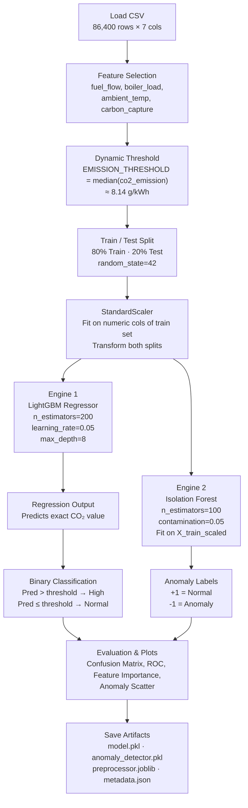
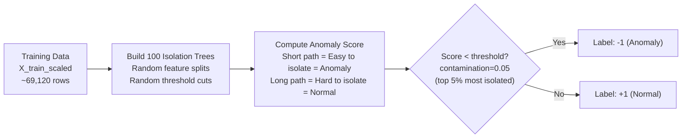
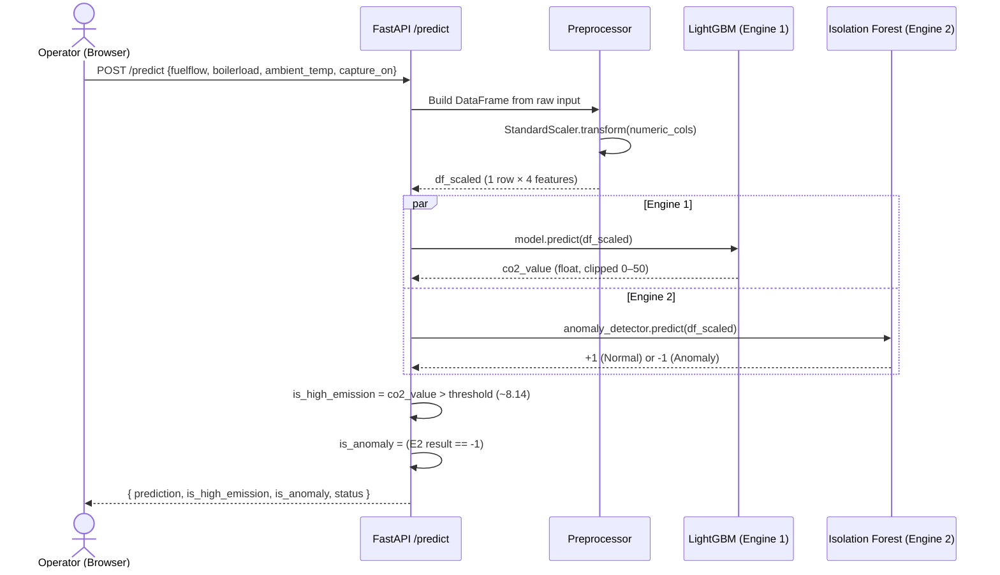
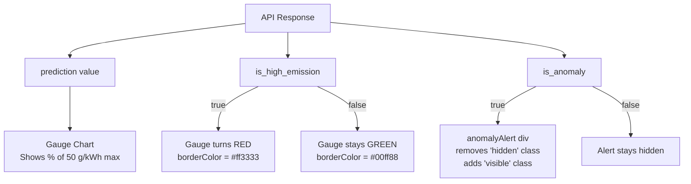
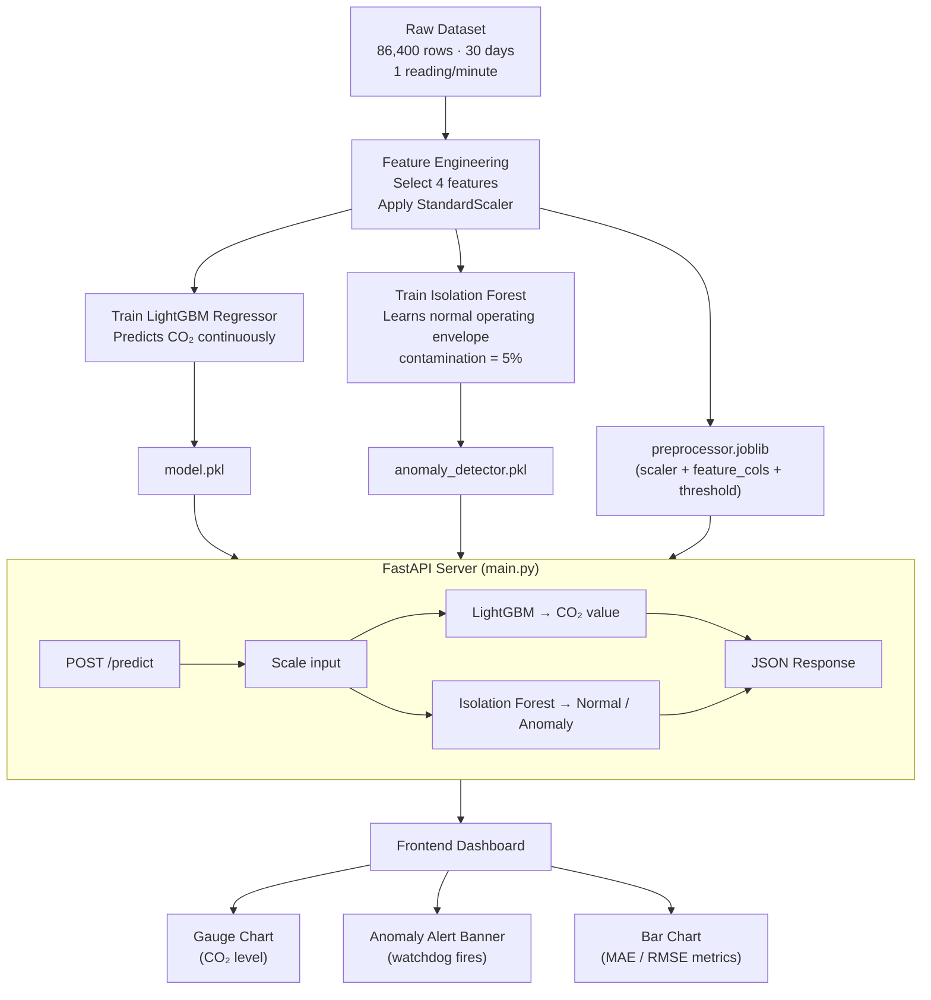

# EcoGrid — Anomaly Detection Workflow

## Overview

**EcoGrid** uses a **Dual-Engine ML Architecture** to monitor CO₂ emissions from thermal power plants. Engine 1 predicts *how much* CO₂ is emitted; Engine 2 acts as an unsupervised **anomaly watchdog** that flags physically impossible or dangerous sensor states — independent of the CO₂ value.

---

## 1.  The Dataset

**File:** `backend/data/processed_synthetic_data_30days.csv`

| Property | Value |
|---|---|
| Total rows | **86,400** (1 reading/minute × 60 mins × 24 hrs × 30 days) |
| Total columns | 7 |
| Time range | 2025-10-11 → 30 days of simulation |

### Columns

| Column | Type | Range | Description |
|---|---|---|---|
| `timestamp` | string | — | Per-minute timestamp |
| `plant_type` | string | Coal | Plant category |
| `fuel_flow` | float | 0.0 – 1.0 | Normalized fuel consumption rate (tons/hr) |
| `boiler_load` | float | 0.0 – 1.0 | Normalized boiler power output (MW) |
| `ambient_temp` | float | 0.0 – 1.0 | Normalized external temperature (°C) |
| `carbon_capture` | int | 0 or 1 | Carbon capture system ON/OFF |
| `co2_emission` | float | 4.34 – 15.0 | Target: CO₂ emission in g/kWh |

>

### CO₂ Emission Statistics

| Statistic | Value |
|---|---|
| Mean | 8.83 g/kWh |
| Median (dynamic threshold) | **~8.14 g/kWh** |
| Std Dev | 2.68 |
| Min / Max | 4.34 / 15.0 |

---

## 2.  Training Pipeline (`train.py`)

---

## 3.  How Isolation Forest Detects Anomalies

**Isolation Forest** is an *unsupervised* algorithm — it **does not need CO₂ labels** to detect anomalies. It learns the *shape of normal operational data* and flags outliers.

### Core Mechanism

### Key Parameters

| Parameter | Value | Effect |
|---|---|---|
| `n_estimators` | 100 | 100 isolation trees built; more = more stable scores |
| `contamination` | 0.05 | Expects **5%** of data to be anomalous; sets the decision threshold |
| `random_state` | 42 | Reproducibility |

### What Gets Flagged as Anomalous?

The model learns the **joint distribution** of all 4 features together. It will flag combinations that are statistically rare in the training set, such as:

-  **Max fuel flow + near-zero boiler load** → physically impossible, likely sensor failure
-  **Extreme ambient temperature** with contradictory operational readings
-  **Sensor drift** — values slowly creeping outside learned normal bounds
-  Any feature vector that lies far from the dense training cluster

---

## 4.  Inference Pipeline (`main.py`)

Every time the user submits plant readings on the frontend, both engines run in **parallel on the same preprocessed input**:

### API Response Fields

| Field | Type | Meaning |
|---|---|---|
| `prediction` | float | Predicted CO₂ emission in g/kWh (0–50) |
| `is_high_emission` | bool | `true` if prediction > median threshold |
| `is_anomaly` | bool | `true` if Isolation Forest returns -1 |
| `status` | string | `"success"` or `"failed"` |

---

## 5.  Frontend Response (`script.js`)

The frontend reacts to all three signals independently:

> [!IMPORTANT]
> **`is_anomaly` and `is_high_emission` are independent signals.** A reading can be:
> -  Normal emission AND Normal (no alert)
> -  High emission AND Normal (gauge turns red, no watchdog alert)
> -  Normal emission AND Anomaly (watchdog fires even though CO₂ looks fine — sensor fault!)
> -  High emission AND Anomaly (both alerts fire simultaneously)

---

## 6.  Model Performance

From `metadata.json`:

| Metric | Value |
|---|---|
| Algorithm | Hybrid LGBM Regressor + Isolation Forest |
| Train R² | 0.6822 |
| Test R² | 0.6746 |
| Train MAE | 1.2663 g/kWh |
| Test MAE | **1.2852 g/kWh** |
| Train RMSE | 1.5089 |
| Test RMSE | **1.5313** |
| Test Accuracy (binary) | **76.03%** |
| Test F1 Score | **78.35%** |

> [!NOTE]
> Train ≈ Test metrics show **no overfitting** — the model generalises well to unseen data.

---

## 7.  Complete End-to-End Flow

---

